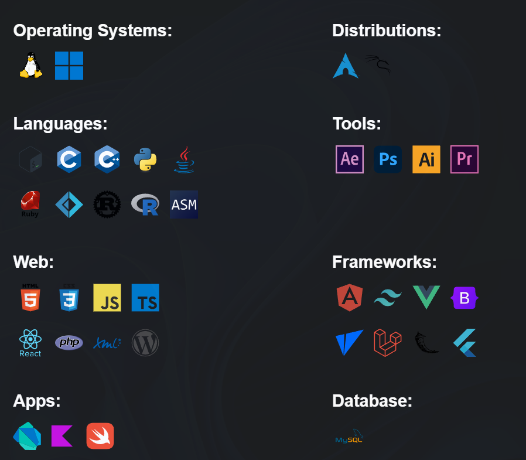

<h1 align="center">Welcome to матија's GitHub</h1>
<h3 align="center">Part of ZeroByte 🩶</h3>

  

- 🔭 I’m currently working on: [KumOS](https://github.com/TodorW/ZephyrOS)!

- 📫 Reach me on Discord: **n11kol1c**

    <b>I'm a programmer who works across different areas of development, from web applications to scripts and tools that solve real-world problems. I focus on learning new technologies, writing clean code, and building projects that are practical and efficient. Whether it's front-end, back-end, or anything in between, I aim to create solutions that work well and have real impact.
</b>

  

 
 

